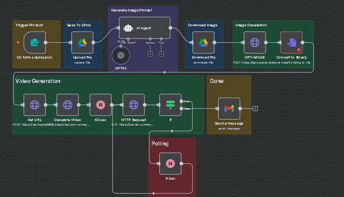

# Overview
Automated Product Videography Workflow with n8n

- Built an end-to-end product videography automation pipeline using n8n, integrating gpt-oss20B for script generation, gpt-image-1 for product imagery, and Runway for transforming images into 360° product videos.

- Automated video production reduced manual editing effort and enabled scalable, AI-driven content creation for product showcasing.

## Workflow

## Result

